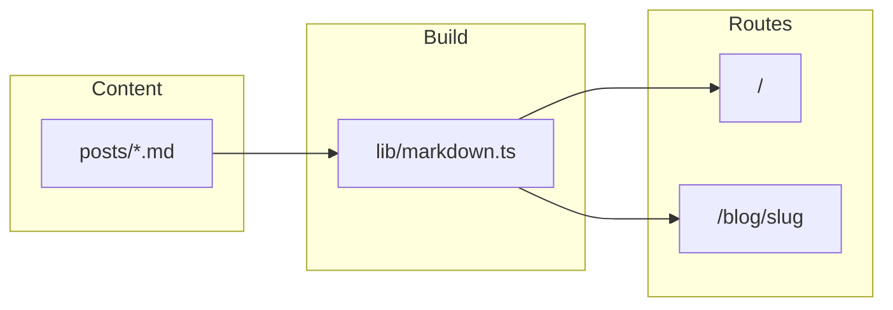

# Readme Blog

<!-- README-I18N:START -->

[Türkçe](./README.md) | **English**

<!-- README-I18N:END -->

[](https://nextjs.org/)
[](https://www.typescriptlang.org/)
[](https://tailwindcss.com/)

> A file-based blog engine with **no database**. Markdown files under `posts/` are read at build time for **SSG**, strong **SEO**, and fast delivery. Fits a GitHub portfolio showcase and runs on **Coolify + Docker** or plain Node.

---

## Overview

| Area | Details |
| ---- | ------- |
| Content | `posts/*.md` with `gray-matter` frontmatter |
| Output | `npm run build` → `.next` → `next start` |
| Highlighting | Shiki (`@shikijs/rehype`), light/dark aware |
| Reading UX | Tailwind Typography (`prose`) |
| TOC | h2/h3 only; `github-slugger` aligned with `rehype-slug` |



---

## Features

- **SSG** via `generateStaticParams` for blog routes.
- **Per-post metadata** with `generateMetadata` (title, description, Open Graph).
- **Reading time** from word count (`src/lib/reading-time.ts`).
- **Drafts** with `draft: true` in frontmatter (excluded from production builds).
- **Theming** with `next-themes` (class-based dark mode).
- **Icons** via `lucide-react`.

---

## Tech stack

- **Framework**: Next.js 16 (App Router), React 19  
- **Language**: TypeScript (`strict`)  
- **Styling**: Tailwind CSS v4, `@tailwindcss/typography`  
- **Markdown**: `unified`, `remark-parse`, `remark-gfm`, `remark-rehype`, `rehype-stringify`, `rehype-slug`, `rehype-autolink-headings`, `@shikijs/rehype`  
- **Frontmatter**: `gray-matter`, `github-slugger` (TOC id parity)

---

## Project layout

```text
readme-blog/
├── posts/                 # Markdown posts
├── public/
├── Dockerfile
├── src/
│   ├── app/
│   ├── components/
│   ├── lib/
│   └── types/
├── .env.example
└── package.json
```

---

## Getting started

```bash
git clone <repo-url>
cd readme-blog
npm ci
npm run dev
```

Open [http://localhost:3000](http://localhost:3000).

---

## Environment variables

Copy `.env.example` to `.env.local`:

| Variable | Purpose |
| -------- | ------- |
| `NEXT_PUBLIC_SITE_URL` | Public site origin for `metadataBase` and Open Graph (e.g. `https://blog.example.com`) |

---

## Writing posts

Add `.md` files under `posts/`. The filename becomes the URL **slug** (`hello.md` → `/blog/hello`).

Required frontmatter: `title`, `date` (ISO 8601 recommended).

```yaml
---
title: "Post title"
date: "2026-03-28"
tags:
  - tag
excerpt: "Short summary for SEO and cards."
draft: false
---

## First section

Body goes here.
```

---

## Scripts

| Script | Description |
| ------ | ----------- |
| `npm run dev` | Development server |
| `npm run build` | Production build |
| `npm run start` | Production server (`next start`) |
| `npm run lint` | ESLint |

---

## Docker and Coolify

The repo includes a multi-stage `Dockerfile`: `npm ci` → `npm run build` → `npm run start`, port **3000**, `HOSTNAME=0.0.0.0`.

Typical Coolify flow:

1. Connect the GitHub repository.  
2. Build with Docker or Node steps (`npm ci`, `npm run build`).  
3. Start with `npm run start`.  
4. Set `NEXT_PUBLIC_SITE_URL` to your public URL.

---

## Security note

Rendered HTML is treated as trusted author content. Do not ingest untrusted Markdown without sanitization.

---

## License

Replace with your preferred license (e.g. MIT).
