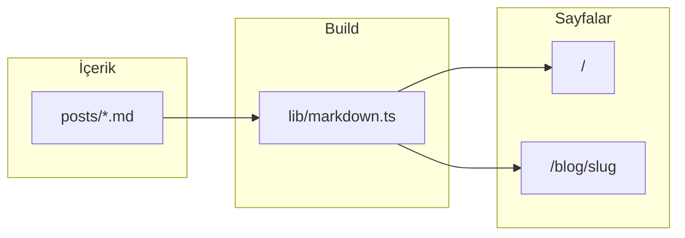

# Readme Blog

<!-- README-I18N:START -->

**Türkçe** | [English](./README.en.md)

<!-- README-I18N:END -->

[](https://nextjs.org/)
[](https://www.typescriptlang.org/)
[](https://tailwindcss.com/)

> Dosya tabanlı, veritabanı gerektirmeyen statik blog motoru. `posts/` içindeki Markdown dosyaları build sırasında okunur; **SSG** ile yüksek performans ve güçlü **SEO** hedeflenir. GitHub profilinizde sergilemek için uygun, üretimde **Coolify + Docker** veya düz Node ile çalıştırılabilir.

---

## Özet

| Özellik | Açıklama |
| -------- | -------- |
| İçerik | `posts/*.md` + `gray-matter` ile frontmatter |
| Çıktı | `npm run build` → `.next` → `next start` |
| Vurgulama | Shiki (`@shikijs/rehype`), açık/koyu tema |
| Okunabilirlik | Tailwind Typography (`prose`) |
| İçindekiler | h2/h3, `github-slugger` + `rehype-slug` ile uyumlu anchor |



---

## Özellikler

- **SSG**: `generateStaticParams` ile blog sayfaları önceden üretilir.
- **Dinamik metadata**: Her yazı için `generateMetadata` (başlık, açıklama, Open Graph).
- **Tahmini okuma süresi**: Kelime sayısına göre dakika (`src/lib/reading-time.ts`).
- **Taslak yazılar**: Frontmatter’da `draft: true` → üretim build’inde dışlanır.
- **Tema**: `next-themes` ile sınıf tabanlı açık/koyu mod.
- **İkonlar**: `lucide-react`.

---

## Teknoloji yığını

- **Framework**: Next.js 16 (App Router), React 19  
- **Dil**: TypeScript (`strict`)  
- **Stil**: Tailwind CSS v4, `@tailwindcss/typography`  
- **Markdown**: `unified`, `remark-parse`, `remark-gfm`, `remark-rehype`, `rehype-stringify`, `rehype-slug`, `rehype-autolink-headings`, `@shikijs/rehype`  
- **Meta**: `gray-matter`, `github-slugger` (TOC id eşleşmesi)

---

## Proje yapısı

```text
readme-blog/
├── posts/                 # Markdown yazılar
├── public/
├── Dockerfile
├── src/
│   ├── app/               # App Router sayfaları
│   ├── components/        # layout, blog bileşenleri
│   ├── lib/               # markdown.ts, reading-time.ts, site.ts
│   └── types/             # Post, TocItem, …
├── .env.example
└── package.json
```

---

## Kurulum

```bash
git clone <repo-url>
cd readme-blog
npm ci
npm run dev
```

Tarayıcıda [http://localhost:3000](http://localhost:3000) adresini açın.

---

## Ortam değişkenleri

`.env.example` dosyasını kopyalayarak `.env.local` oluşturun:

| Değişken | Açıklama |
| -------- | -------- |
| `NEXT_PUBLIC_SITE_URL` | Canlı site kökü (`metadataBase`, Open Graph). Örnek: `https://blog.example.com` |

---

## İçerik yazma

`posts/` altına `.md` dosyası ekleyin. Dosya adı URL **slug** olur (`merhaba.md` → `/blog/merhaba`).

Zorunlu frontmatter alanları: `title`, `date` (ISO 8601 önerilir).

```yaml
---
title: "Yazı başlığı"
date: "2026-03-28"
tags:
  - etiket
excerpt: "Kısa özet (SEO ve kartlarda)."
draft: false
---

## İlk bölüm

İçerik burada.
```

---

## Komutlar

| Komut | Açıklama |
| ----- | -------- |
| `npm run dev` | Geliştirme sunucusu |
| `npm run build` | Üretim derlemesi |
| `npm run start` | Üretim sunucusu (`next start`) |
| `npm run lint` | ESLint |

---

## Docker ve Coolify

Çok aşamalı `Dockerfile` örneği repoda mevcuttur: `npm ci` → `npm run build` → `npm run start`, port **3000**, `HOSTNAME=0.0.0.0`.

Coolify’da örnek akış:

1. GitHub deposunu bağlayın.  
2. Build: `docker build -t readme-blog .` veya platformun Node build adımları (`npm ci`, `npm run build`).  
3. Start: `npm run start`.  
4. Üretim URL’sini `NEXT_PUBLIC_SITE_URL` olarak verin.

---

## Güvenlik notu

Markdown HTML’e dönüştürülüp sunucuda güvenilir kaynaklardan geldiği varsayılır. Üçüncü taraftan ham Markdown kabul etmeyin veya ayrıca sanitize edin.

---

## Lisans

Bu şablon projeyi kendi lisans tercihinize göre güncelleyin (ör. MIT).
